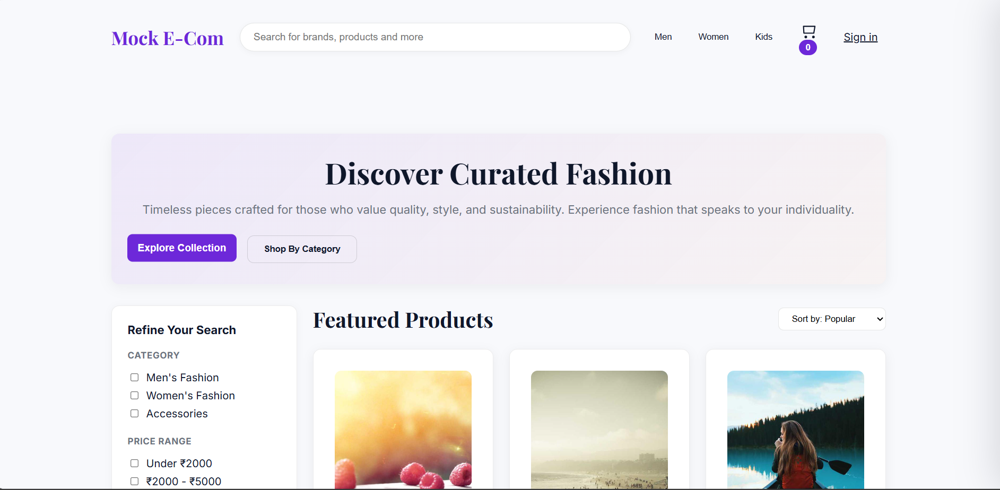
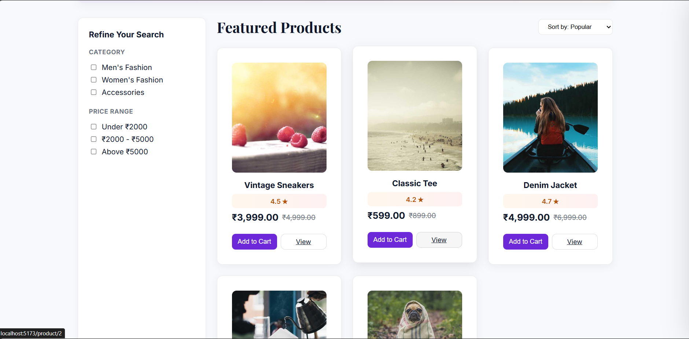
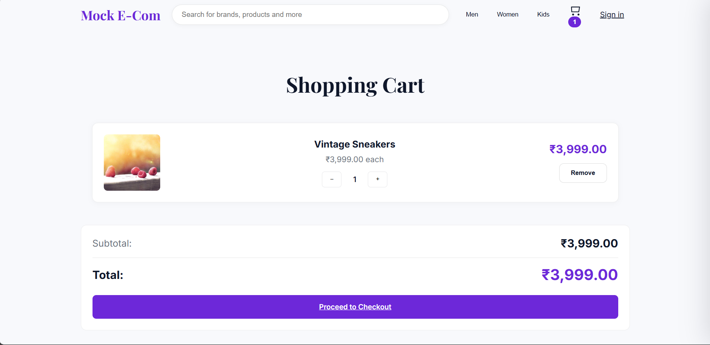
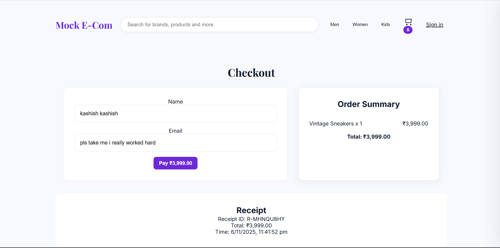

<div align="center">

  <h1> Ecommerce Cart</h1>
  <p><strong>A Simple, Modern Shopping Cart & E-commerce with login/signup Authentication</strong></p>

  <p>
    
    
    
    
    
  </p>

  <p>
    <a href="#features">✨ Features</a> •
    <a href="#tech-stack">🛠️ Tech Stack</a> •
    <a href="#installation">⚡ Installation</a> •
    <a href="#api-routes">🔌 API Routes</a> •
    <a href="#contributing">🤝 Contributing</a>
  </p>
</div>

---

## 📖 About

**Ecommerce Cart** is a starter e-commerce application that demonstrates a product catalog, shopping cart, checkout flow, and a small REST API backend. It’s suitable as a learning project, a base for a custom storefront, or a template to extend with payment providers and custom business logic.

### 🎯 Key Highlights

- Product listing with categories and search
- Persistent shopping cart (client-side + backend sync)
- Checkout flow (order creation and basic payments integration)
- User authentication (register/login) with JWT
- RESTful API structure ready for extensions
- Responsive React frontend with clean components

---

## ✨ Features

### 🛒 Cart & Checkout
- Add/remove/update product quantities in cart
- Persist cart between sessions (localStorage + backend)
- Create orders from cart content
- Example payments integration (Stripe placeholder)

### 🧾 Product Management
- Product listing and detail pages
- Category filtering and search
- Admin-style endpoints for creating/updating products (can be protected/extended)

### 👥 Authentication
- Sign up and login using email and password
- JWT-based protected routes
- Password hashing with bcrypt

### ⚙️ Developer Ergonomics
- Clear project structure (client / backend)
- Environment-driven configuration
- Ready-to-extend API and UI components

---

## 📸 Screenshots

<div align="center">

### 🏠 Homepage


### 🧾 Product Page


### 🛍️ Cart 


### 🛍️ Checkout


</div>

---

## 🛠️ Tech Stack

<div align="center">

<table>
<tr>
<td width="50%">

### Frontend
| Technology | Purpose |
|------------|---------|
| React | UI library |
| Vite / Create React App | Build & dev server |
| React Router | Client-side routing |
| Axios / Fetch | HTTP client |
| Zustand / Context / Redux | State management (cart + user) |
| CSS / Tailwind / Styled Components | Styling |

</td>
<td width="50%">

### Backend
| Technology | Purpose |
|------------|---------|
| Node.js | Runtime |
| Express.js | Web framework |
| MongoDB | Database |
| Mongoose | ODM |
| JWT | Authentication |
| bcryptjs | Password hashing |
| Stripe (example) | Payments integration |
| CORS, cookie-parser | Middleware |

</td>
</tr>
</table>

</div>

---

## 🚀 Installation

### Prerequisites
- Node.js (v16+)
- MongoDB (local or hosted, e.g., MongoDB Atlas)
- (Optional) Stripe account for payment testing
- Git

### 1. Clone the repository
```bash
git clone https://github.com/kashishchadha/ecommerce-cart.git
cd ecommerce-cart
```

### 2. Backend Setup
```bash
cd backend
npm install
```

Create a `.env` file in the backend directory. Typical variables:
```env
PORT=5000
MONGODB_URI=mongodb+srv://<user>:<password>@cluster0.mongodb.net/ecommerce?retryWrites=true&w=majority
JWT_SECRET=your_jwt_secret
STRIPE_SECRET_KEY=sk_test_...
CLIENT_URL=http://localhost:5173
```

Start the backend:
```bash
npm run dev
```
(Or `node index.js` / `npm start` depending on scripts.)

### 3. Frontend Setup
```bash
cd ../client
npm install
```

Create a `.env` file in the client directory. Typical variables:
```env
VITE_API_URL=http://localhost:5000/api
VITE_STRIPE_PUBLISHABLE_KEY=pk_test_...
```

Start the frontend dev server:
```bash
npm run dev
```

### 4. Open the app
- Frontend: http://localhost:5173 (or port shown by Vite/CRA)
- Backend API: http://localhost:5000

---

## 🔌 API Routes (sample)

> Base path: /api

### Auth (`/api/auth`)
- POST /register — Register new user
- POST /login — Login, returns JWT
- POST /logout — Logout (optional)

### Users (`/api/users`)
- GET /:id — Get user profile
- PUT /:id — Update user (protected)

### Products (`/api/products`)
- GET / — List products (query: category, search, page)
- GET /:id — Get product details
- POST / — Create product (admin)
- PUT /:id — Update product (admin)
- DELETE /:id — Delete product (admin)

### Cart (`/api/cart`)
- GET /:userId — Get saved cart for user
- POST /:userId — Save/update cart for user
- DELETE /:userId — Clear cart

### Orders (`/api/orders`)
- POST / — Create order (from cart)
- GET /:userId — List orders for user
- GET /:id — Order details

### Payments (example)
- POST /create-payment-intent — Create Stripe payment intent (example flow)

---

## 📁 Project Structure

```
ecommerce-cart/
├── client/                   # React frontend
│   ├── public/
│   │   └── logo.png
│   ├── src/
│   │   ├── components/       # UI components (ProductCard, Cart, Navbar, etc.)
│   │   ├── pages/            # Page views (Home, Product, Cart, Checkout)
│   │   ├── context/          # State management (cart, auth)
│   │   ├── api/              # API wrappers (axios instances)
│   │   └── main.jsx
│   └── package.json
│
├── backend/                  # Express API
│   ├── controllers/          # Route handlers
│   ├── models/               # Mongoose models (User, Product, Order, Cart)
│   ├── routes/               # Express routes
│   ├── middleware/           # Auth/misc middleware
│   ├── utils/                # Helpers (email, payment helpers)
│   ├── index.js              # Server entry
│   └── package.json
│
├── Screenshots/              # Example screenshots
├── .env.example              # Example env variables
└── README.md
```

---

## 🎨 Scripts

### Frontend
```bash
npm run dev      # Start dev server
npm run build    # Build for production
npm run preview  # Preview the build (if using Vite)
npm run lint     # Lint code
```

### Backend
```bash
npm run dev      # Start dev server (nodemon)
npm start        # Start production server
```

---

## 🌟 Notes & Next Steps

- Add role-based protection for admin product management routes.
- Integrate a full Stripe checkout or other payment provider for production-level payments.
- Add tests (Jest / React Testing Library / supertest).
- Add CI/CD pipeline and deploy frontend (Vercel/Netlify) and backend (Heroku/Railway/AWS).

---

## 🤝 Contributing

Thanks for wanting to contribute! Please:

1. Fork the repo
2. Create a branch: git checkout -b feature/awesome-thing
3. Commit your changes: git commit -m "Add awesome feature"
4. Push to your branch: git push origin feature/awesome-thing
5. Open a pull request

Guidelines:
- Keep PRs small and focused
- Add or update tests for new features
- Follow existing code style

---

## 📝 License

This project is available under the MIT License. See the LICENSE file for details.

---

## 🙏 Acknowledgments

- React, Express, and MongoDB communities
- Stripe (for payment demos and docs)
- Open-source contributors and tutorials that inspired patterns used here

---

<div align="center">
  <p>Made with ❤️ by <a href="https://github.com/kashishchadha">kashishchadha</a></p>
  <p>⭐ Star this repo if you find it helpful!</p>
</div>
